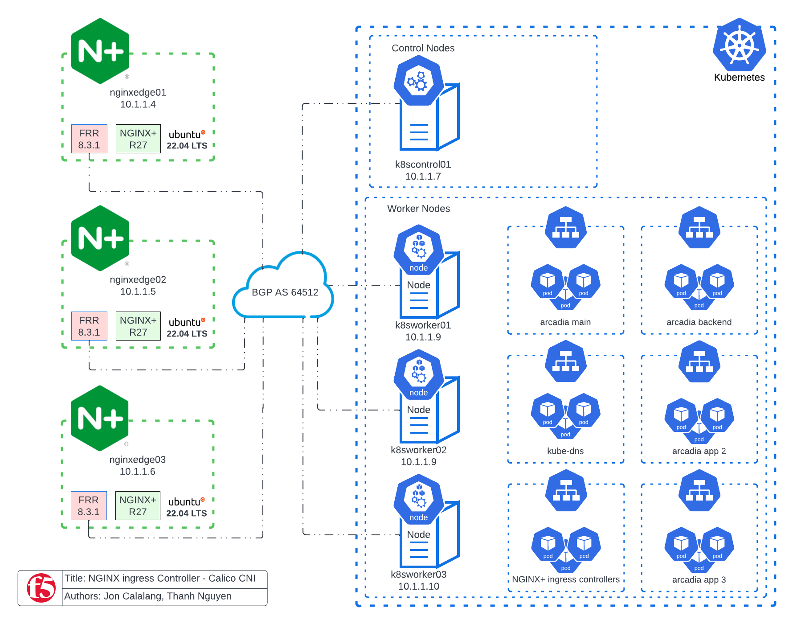

# Get me to the Cluster Lab - NGINX+ Ingress Controllers + NGINX+ Edge Servers
> This is a lab environment to demonstrate the configuration and setup of a Kubernetes Cluster, Calico CNI, NGINX+ L4 Edge Servers, and NGINX+ Ingress Controllers. This lab environment is loosely based on the whitepaper - https://www.nginx.com/resources/library/get-me-to-the-cluster/.  




Infrastructure Lab Details
- 10.1.1.4 - nginxedge01.f5.local 
- 10.1.1.5 - nginxedge02.f5.local 
- 10.1.1.6 - nginxedge03.f5.local
- 10.1.1.7 - k8scontrol01.f5.local 
- 10.1.1.8 - k8sworker01.f5.local 
- 10.1.1.9 - k8sworker02.f5.local 
- 10.1.1.10 - k8sworker03.f5.local 

- user: user01
- pass: f5agility!

Client Desktop
- 10.1.1.11 - client.f5.local
- user: ubuntu
- pass: f5agility!

Observability Lab Details
- 10.1.1.13 central-prometheus01.f5.local 
- 10.1.1.14 central-grafana01.f5.local 

- Linux user: user01
- Linux pass: f5agility!


> UDF blueprint has prerequisite software like containerd and kubectl/kubeadmin/kubelet packages.  This lab also uses local  hostfile for DNS resolution.  UDF blueprint is listed as "NGINX Ingress Controller - Calico CNI - Get me to the Cluster"

> Additional changes that were made from the white paper:
- Ubuntu 22.04 LTS 
- FRR routing package was used instead of Quagga
- 10.1.1.0/24 is the underlay network
- 172.16.1.0/24 will be the POD network to be advertised via iBGP
- Additional DNS resiliency was added by advertising a single /32 route for the KUBE-DNS service instead using the individual kube-dns pod IPs in the resolv.conf files.
- In this lab, we will not be utilizing the IP Pools functionality of the whitepaper.


## Table_of_Contents
- [K8s control node initialization](#K8s_Installation)
- [Calico installation](#Calico_Installation)
- [Add K8s worker nodes to cluster](#Worker_Nodes_Initialization)
- [Calico iBGP configuration](#Calico_iBGP_configuration)
- [NGINX+ Ingress Controller deployment](#NGINX_Ingress_Controller_deployment)
- [NGINX+ Edge installation](#NGINX_Edge_installation)
- [FRR installation](#FRR_installation)
- [FRR iBGP configuration](#FRR_iBGP_configuration)
- [iBGP testing](#iBGP_testing)
- [NGINX+ Edge DNS resolution](#NGINX_Edge_DNS_resolution)
- [Deploy an App](#Deploy_an_App)
- [Expose an app via NGINX+ Ingress Controller](#Expose_an_App_with_NGINX_Ingress_Controller) 
- [NGINX+ Edge L4 configuration](#NGINX_Edge_L4_configuration)
- [NGINX+ HA configurations](#NGINX_HA_configurations)
- [NGINX Management Suite](#NGINX_Management_Suite)
- [Multiple NGINX Ingress Controllers Deployment](#Multiple_NGINX_Ingresses)
- [NGINX+ Ingress Controllers and Istio Service Mesh integration](#NGINX_Ingress_with_Istio_Service_Mesh)
- [NGINX+ Observability with Prometheus and Grafana](#Observability_with_Prometheus_and_Grafana_NGINX_EDGE)


---
## K8s_Installation
> During this section, you will initialize the kubernetes cluster on k8scontrol01.f5.local.  Utilize the UDF portal to log in via the web shell.
1. Log into k8scontrol01.f5.local 
2. Initialize kubernetes cluster as root user
```shell
echo 1 > /proc/sys/net/ipv4/ip_forward
kubeadm config images pull
kubeadm init --control-plane-endpoint=k8scontrol01.f5.local --pod-network-cidr=172.16.1.0/24
```
3. Note the output of k8s intialization.  Copy the text output to a seperate file on how to add additional worker nodes to the K8s cluster.  The worker nodes output will be required in a later step in the lab.
4. Switch to user01 (Password: f5agility!)
```shell
su - user01
```
5. Create kubernetes directories in user01 folder
```shell
mkdir -p $HOME/.kube

sudo cp -i /etc/kubernetes/admin.conf $HOME/.kube/config

sudo chown $(id -u):$(id -g) $HOME/.kube/config
```
6. Confirm cluster installation.  NOTE: that the status of the control node will be listed as NotReady.  This is because the cluster does not yet have a CNI installed yet.  You will install Calico in the next section of the lab.
```shell
kubectl cluster-info
kubectl get nodes
```
[Return to Table of Contents](Table_of_Contents)
---
## Calico_Installation
> During this section, you will be installing Calico as the K8s CNI.  You will also install Calicoctl which is a command line tool to manage Calico resources and perform adminstrative functions. Additional documentation can be found here: 
- https://projectcalico.docs.tigera.io/getting-started/kubernetes/quickstart
- https://projectcalico.docs.tigera.io/maintenance/clis/calicoctl/install

1. Download the Calico manifest to the K8s control01 node.  
```shell
curl https://raw.githubusercontent.com/projectcalico/calico/v3.24.1/manifests/tigera-operator.yaml -O

curl https://raw.githubusercontent.com/projectcalico/calico/v3.24.1/manifests/custom-resources.yaml -O
```
2. Edit the custom-resources manifest to configure 172.16.1.0/24 CIDR for pod network.
```shell
nano custom-resources.yaml
```
3. Below is an example of custom-resources.yaml
```shell
# This section includes base Calico installation configuration.
# For more information, see: https://projectcalico.docs.tigera.io/master/reference/installation/api#operator.tigera.io/v1.Installation
apiVersion: operator.tigera.io/v1
kind: Installation
metadata:
  name: default
spec:
  # Configures Calico networking.
  calicoNetwork:
    # Note: The ipPools section cannot be modified post-install.
    ipPools:
    - blockSize: 26
      cidr: 172.16.1.0/24
      encapsulation: VXLANCrossSubnet
      natOutgoing: Enabled
      nodeSelector: all()

---

# This section configures the Calico API server.
# For more information, see: https://projectcalico.docs.tigera.io/master/reference/installation/api#operator.tigera.io/v1.APIServer
apiVersion: operator.tigera.io/v1
kind: APIServer 
metadata: 
  name: default 
spec: {}
```
4. Deploy Calico CNI
```shell
kubectl create -f tigera-operator.yaml

kubectl create -f custom-resources.yaml
```
5. Confirm Calico deployment.  Confirm that all of the calico pods are in a Running state. Once all pods are in a Running state, <CRTL+c> to break and move to the next step.
```shell
watch kubectl get pods -n calico-system
```
6. Install Calicoctl into the /usr/local/bin/
```shell
cd /usr/local/bin/

sudo curl -L https://github.com/projectcalico/calico/releases/download/v3.24.1/calicoctl-linux-amd64 -o calicoctl

sudo chmod +x ./calicoctl
```
7. Confirm Calicoctl installation.  Confirm the the Calico process is running.  NOTE: no BGP peers will be found as we will configure that in later portion of the lab.  
```shell
sudo calicoctl node status
```
8. Switch back to home directory
```shell
cd /home/user01
```
- [Return to Table of Contents](Table_of_Contents)
---
## Worker_Nodes_Initialization
> During this section, you will add the worker nodes to K8's cluster.
1. Log into k8sworker01.f5.local via UDF web shell
2. As root user, add the worker node to the cluster using the output from K8s init command. 
3. Update IP forward setting
```shell
echo 1 > /proc/sys/net/ipv4/ip_forward
```
4. Sample command - This will NOT be the same command that you will enter
```shell
kubeadm join k8scontrol01.f5.local:6443 --token 4fpx9j.rum6ldoc63t3p0gy \
        --discovery-token-ca-cert-hash sha256:5990a4cb02eea640c88b3c764bd452b932d1228380f22368bc48eff439cd7469 
```
5. Repeat this process on the remainaing worker nodes k8sworker02.f5.local and k8sworker3.f5.local 
6. As user01 on k8scontrol01.f5.local command line, confirm the K8s cluster status. NOTE: the k8s nodes will now show their status as Ready. Calico node pods should be deployed on both worker and control nodes.  Core DNS pods should also be running now. 
```shell
kubectl get nodes -o wide

kubectl get pods --all-namespaces -o wide
```
- [Return to Table of Contents](Table_of_Contents)
---
## Calico_iBGP_configuration
> In this section, you will configure BGP for Calico.
1. On the k8scontrol01.f5.local create a bgpConfiguration.yaml file to define the initial BGP configurations.  
```shell
nano bgpConfiguration.yaml
```
2. Edit the contents of the yaml file to your environment details.  In this lab we are utilizing Calico's default ASN number - 64512
```shell
apiVersion: projectcalico.org/v3
kind: BGPConfiguration
metadata:
  name: default
spec:
  logSeverityScreen: Info
  nodeToNodeMeshEnabled: true
  asNumber: 64512
```
3. Deploy the BGP configuration manifest to the Calico CNI.
```shell
calicoctl create -f bgpConfiguration.yaml
```
4. Next you will create the definition of the BGP Peers for the lab evironment. Create bgppeers.yaml file.
```shell
nano bgppeers.yaml
```
5. Edit the confents of the yaml file to define your BGP peers.  This file will now point to each K8s node and each NGINX+ Edge instance.  
```
apiVersion: projectcalico.org/v3 
kind: BGPPeer
metadata:
  name: bgppeer-global-k8scontrol01 
spec:
  peerIP: 10.1.1.7
  asNumber: 64512 
---
apiVersion: projectcalico.org/v3 
kind: BGPPeer
metadata:
  name: bgppeer-global-k8sworker01 
spec:
  peerIP: 10.1.1.8
  asNumber: 64512 
---
apiVersion: projectcalico.org/v3 
kind: BGPPeer
metadata:
  name: bgppeer-global-k8sworker02
spec:
  peerIP: 10.1.1.9
  asNumber: 64512 
---
apiVersion: projectcalico.org/v3 
kind: BGPPeer
metadata:
  name: bgppeer-global-k8sworker03
spec:
  peerIP: 10.1.1.10
  asNumber: 64512 
---
apiVersion: projectcalico.org/v3 
kind: BGPPeer
metadata:
  name: bgppeer-global-nginxedge01 
spec:
  peerIP: 10.1.1.4
  asNumber: 64512
---
apiVersion: projectcalico.org/v3 
kind: BGPPeer
metadata:
  name: bgppeer-global-nginxedge02 
spec:
  peerIP: 10.1.1.5
  asNumber: 64512
---
apiVersion: projectcalico.org/v3 
kind: BGPPeer
metadata:
  name: bgppeer-global-nginxedge03
spec:
  peerIP: 10.1.1.6
  asNumber: 64512
```
6. Deploy the BGP peers manifest to the Calico CNI.
```shell
calicoctl create -f bgppeers.yaml
```
7. Get BGP configurations. (NOTE: the NGINX+ Edge servers will be in a Connection Refused state. This is because the NGINX+ Edge servers have not yet been configured with BGP. You will configure the BGP on the Edge servers later in the lab.)
```shell
calicoctl get bgpConfiguration

calicoctl get bgpPeer

sudo calicoctl node status
```
- [Return to Table of Contents](Table_of_Contents)
---
## NGINX+_Ingress_Controller_deployment
> In this section, you will deploy NGINX+ Ingress Controller via a manifest using a JWT token as a deployment.  In order to get your JWT token, log into your myF5 portal and download your JWT token entitlement. Additional documentation can be found here: 
- https://docs.nginx.com/nginx-ingress-controller/installation/installation-with-manifests/
- https://docs.nginx.com/nginx-ingress-controller/installation/using-the-jwt-token-docker-secret 

1. On the k8scontrol01.f5.local, clone the NGINX+ Ingress controller repo.
```shell
git clone https://github.com/nginxinc/kubernetes-ingress.git --branch v2.3.1
```
2. Configure RBAC
```shell
kubectl apply -f kubernetes-ingress/deployments/common/ns-and-sa.yaml

kubectl apply -f kubernetes-ingress/deployments/rbac/rbac.yaml 
```
3. Modify downloaded manifest to enable NGINX+ Ingress Controller as default ingress class
```shell
nano kubernetes-ingress/deployments/common/ingress-class.yaml
```
4. Uncomment the annotation ingressclass.kubernetes.io/is-default-class. With this annotation set to true all the new Ingresses without an ingressClassName field specified will be assigned this IngressClass.
```shell
apiVersion: networking.k8s.io/v1
kind: IngressClass
metadata:
  name: nginx
  annotations: 
    ingressclass.kubernetes.io/is-default-class: "true" 
spec:
  controller: nginx.org/ingress-controller
```
5. Create Common Resources
```shell
kubectl apply -f kubernetes-ingress/deployments/common/default-server-secret.yaml

kubectl apply -f kubernetes-ingress/deployments/common/nginx-config.yaml

kubectl apply -f kubernetes-ingress/deployments/common/ingress-class.yaml
```
6. Create Custom Resources
```shell
kubectl apply -f kubernetes-ingress/deployments/common/crds/k8s.nginx.org_virtualservers.yaml

kubectl apply -f kubernetes-ingress/deployments/common/crds/k8s.nginx.org_virtualserverroutes.yaml

kubectl apply -f kubernetes-ingress/deployments/common/crds/k8s.nginx.org_transportservers.yaml

kubectl apply -f kubernetes-ingress/deployments/common/crds/k8s.nginx.org_policies.yaml

kubectl apply -f kubernetes-ingress/deployments/common/crds/k8s.nginx.org_globalconfigurations.yaml
```
7. Create docker-registry secret on the cluster using the JWT token from your myF5 account. (NOTE: Replace the < JWT Token > with the JWT token information from your myF5.com portal.  Your entry could resemble --docker-username=a93hfganasd3h4BSkaj)
```shell
kubectl create secret docker-registry regcred --docker-server=private-registry.nginx.com --docker-username=<JWT Token> --docker-password=none -n nginx-ingress
```
8. Confirm the details of the secret
```shell
kubectl get secret regcred --output=yaml -n nginx-ingress
```
9. Modify the NGINX+ Ingress Controller manifest
```shell
nano kubernetes-ingress/deployments/deployment/nginx-plus-ingress.yaml
```
10. Update the contents of the yaml file:
- Increase the number of NGINX+ replicas to 3
- Utilize the docker-registry secret create in the previous step
- Update the container location to pull from private-registry.nginx.com
```shell
apiVersion: apps/v1
kind: Deployment
metadata:
  name: nginx-ingress
  namespace: nginx-ingress
spec:
  replicas: 3
  selector:
    matchLabels:
      app: nginx-ingress
  template:
    metadata:
      labels:
        app: nginx-ingress
     #annotations:
       #prometheus.io/scrape: "true"
       #prometheus.io/port: "9113"
       #prometheus.io/scheme: http
    spec:
      serviceAccountName: nginx-ingress
      automountServiceAccountToken: true
      imagePullSecrets:
      - name: regcred
      containers:
      - image: private-registry.nginx.com/nginx-ic/nginx-plus-ingress:2.3.1
        imagePullPolicy: IfNotPresent
        name: nginx-plus-ingress
        ports:
        - name: http
          containerPort: 80
        - name: https
          containerPort: 443
        - name: readiness-port
          containerPort: 8081
        - name: prometheus
          containerPort: 9113
        readinessProbe:
          httpGet:
            path: /nginx-ready
            port: readiness-port
          periodSeconds: 1
        resources:
          requests:
            cpu: "100m"
            memory: "128Mi"
         #limits:
         #  cpu: "1"
         #  memory: "1Gi"
        securityContext:
          allowPrivilegeEscalation: true
          runAsUser: 101 #nginx
          runAsNonRoot: true
          capabilities:
            drop:
            - ALL
            add:
            - NET_BIND_SERVICE
        env:
        - name: POD_NAMESPACE
          valueFrom:
                      fieldRef:
              fieldPath: metadata.namespace
        - name: POD_NAME
          valueFrom:
            fieldRef:
              fieldPath: metadata.name
        args:
          - -nginx-plus
          - -nginx-configmaps=$(POD_NAMESPACE)/nginx-config
          - -default-server-tls-secret=$(POD_NAMESPACE)/default-server-secret
         #- -enable-cert-manager
         #- -enable-external-dns
         #- -enable-app-protect
         #- -enable-app-protect-dos
         #- -v=3 # Enables extensive logging. Useful for troubleshooting.
         #- -report-ingress-status
         #- -external-service=nginx-ingress
         #- -enable-prometheus-metrics
         #- -global-configuration=$(POD_NAMESPACE)/nginx-config
```
11. Run NGINX+ Ingress Controller
```shell
kubectl apply -f kubernetes-ingress/deployments/deployment/nginx-plus-ingress.yaml
```
12. Confirm NGINX+ Ingress Controller pods are running. 
```shell
kubectl get pods --namespace=nginx-ingress
```
13. Create a service for the Ingress Controller pods.
```shell
nano nginx-ingress-svc.yaml
```
14. Create the nginx-ingress-svc.yaml service to be a headless service utilizing ports 80 and 443 inside the nginx-ingress namespace
```shell
apiVersion: v1
kind: Service
metadata:
  name: nginx-ingress-svc
  namespace: nginx-ingress
spec:
  type: ClusterIP
  clusterIP: None
  ports:
  - port: 80
    targetPort: 80
    protocol: TCP
    name: http
  - port: 443
    targetPort: 443
    protocol: TCP
    name: https
  selector:
    app: nginx-ingress
```
15. Deploy the service via manifest 
```shell
kubectl apply -f nginx-ingress-svc.yaml 
```
16. Confirm that the NGINX+ ingress service is running.  NOTE: Kube-DNS service is also running.
```shell
kubectl get services --all-namespaces -o wide
```
- [Return to Table of Contents](Table_of_Contents)
---
## NGINX+_Edge_installation
> In this section, you will be installing NGINX+ on the edge servers outside of the K8's cluster.  These edge servers will be responible for L4 Load Balancing to the K8's clusters.  In order to complete this section, log into your myF5.com account and download the cert and key for NGINX+.  Additional documentation can be found here:
- https://docs.nginx.com/nginx/admin-guide/installing-nginx/installing-nginx-plus/
1. Log into nginxedge01.f5.local as user01
```shell
su - user01
```
2. Create the /etc/ssl/nginx directory
```shell
sudo mkdir /etc/ssl/nginx

cd /etc/ssl/nginx
```
3. Create nginx-repo.crt
```shell
sudo nano nginx-repo.crt
```
4. Paste contents of the crt from your nginx-repo.crt downloaded from myF5 portal.
5. Create nginx-repo.key
```shell
sudo nano nginx-repo.key
```
6. Paste contents of key from your nginx-repo.key downloaded from myF5 portal.
7. Switch back to home directory
```shell
cd /home/user01
```
8. Install the prerequisites packages.
```shell
sudo apt-get install apt-transport-https lsb-release ca-certificates wget gnupg2 ubuntu-keyring
```
9. Download and add NGINX signing key and App Protect security updates signing key:
```shell
wget -qO - https://cs.nginx.com/static/keys/nginx_signing.key | gpg --dearmor | sudo tee /usr/share/keyrings/nginx-archive-keyring.gpg >/dev/null

wget -qO - https://cs.nginx.com/static/keys/app-protect-security-updates.key | gpg --dearmor | sudo tee /usr/share/keyrings/app-protect-security-updates.gpg >/dev/null
```
10. Add the NGINX Plus repository.
```shell
printf "deb [signed-by=/usr/share/keyrings/nginx-archive-keyring.gpg] https://pkgs.nginx.com/plus/ubuntu `lsb_release -cs` nginx-plus\n" | sudo tee /etc/apt/sources.list.d/nginx-plus.list
```
11. Download the nginx-plus apt configuration to /etc/apt/apt.conf.d:
```shell
sudo wget -P /etc/apt/apt.conf.d https://cs.nginx.com/static/files/90pkgs-nginx
```
12. Update the repository information:
```shell
sudo apt-get update
```
13. Install the nginx-plus package. 
```shell
sudo apt-get install -y nginx-plus
```
14. Check the nginx binary version to ensure that you have NGINX Plus installed correctly:
```shell
nginx -v
```
15. Repeat NGINX+ installation on nginxedge02.f5.local
16. Repeat NGINX+ installation on nginxedge03.f5.local 
- [Return to Table of Contents](Table_of_Contents)
---
## FRR_installation
> In this section, you will install FRR package as to enable BGP functionality on the NGINX+ Edge servers.  Additional documentation can be found here: 
-  https://docs.frrouting.org/projects/dev-guide/en/latest/building-frr-for-ubuntu2004.html
1. Install dependencies
```shell
sudo apt-get install \
   git autoconf automake libtool make libreadline-dev texinfo \
   pkg-config libpam0g-dev libjson-c-dev bison flex \
   libc-ares-dev python3-dev python3-sphinx \
   install-info build-essential libsnmp-dev perl \
   libcap-dev python2 libelf-dev libunwind-dev
```
2. Install FRR package
```shell
sudo apt-get install frr -y
```
3. Enable BGP process for FRR daemons by editing the 
```shell
sudo systemctl stop frr

sudo nano /etc/frr/daemons
```
4. Edit the file to to enable bgpd
```shell
bgpd=yes
```
5. Enable and confirm FRR service is active and running.
```shell
sudo systemctl enable frr.service

sudo systemctl restart frr.service

sudo systemctl status frr
```
6. Repeat NGINX+ installation on nginxedge02.f5.local
7. Repeat NGINX+ installation on nginxedge03.f5.local 
- [Return to Table of Contents](Table_of_Contents)
---
## FRR_iBGP_configuration
> In this section, you will configure iBGP on the NGINX+ Edge server and build a mesh with the K8's Calico CNI.  
1. Log into the FRR routing shell
```shell
sudo vtysh
```
2. Configure BGP network and neighbors.
```shell
config t
router bgp 64512
bgp router-id 10.1.1.4   
network 10.1.1.0/24
neighbor calico peer-group
neighbor calico remote-as 64512
neighbor calico capability dynamic
neighbor 10.1.1.5 peer-group calico
neighbor 10.1.1.5 description nginxedge02
neighbor 10.1.1.6 peer-group calico 
neighbor 10.1.1.6 description nginxedge03
neighbor 10.1.1.7 peer-group calico 
neighbor 10.1.1.7 description k8scontrol01
neighbor 10.1.1.8 peer-group calico
neighbor 10.1.1.8 description k8sworker01
neighbor 10.1.1.9 peer-group calico
neighbor 10.1.1.9 description k8sworker02
neighbor 10.1.1.10 peer-group calico
neighbor 10.1.1.10 description k8sworker03
exit
exit 
write
```
3. Confirm configurations
```shell
show running-config

show ip bgp summary

show bgp neighbors

show ip route
```
4. Exit vtysh shell
```shell
exit
```
5. Repeat BGP configurations step on nginxedge02.f5.local.  Be sure to modify the bgp router-id IP address to 10.1.1.5 and include nginxedge01 and nginxedge03 as peers.
6. Repeat BGP configurations step on nginxedge03.f5.local.  Be sure to modify the bgp router-id IP address to 10.1.1.6 and include nginxedge01 and nginxedge02 as peers.
7. Upon completion of this section, the bgp configurations should show all of the NGINX+ edge and K8s nodes connected via BGP.  
- [Return to Table of Contents](Table_of_Contents)
---
## NGINX+_Edge_DNS_resolution
> In this section, you will setup DNS resolution on the NGINX+ Edge servers to utilize the internal DNS core-dns solution. As part of this lab, we will be advertising the service IP versus the individual pod endpoint ips as shown in the whitepaper. Additional documentation can be found here:
- https://projectcalico.docs.tigera.io/networking/advertise-service-ips
1. Log into k8scontrol01.f5.local as user01.
2. Describe the kube-dns service to get IP address information.  NOTE the Service IP address and the pod endpoint IP addresses.  In this lab example, we will be utilizing the Service IP address in the 10.96.0.10.  
```shell
kubectl describe svc kube-dns -n kube-system
```
3. Update the existing bgpConfiguration.yaml manifest to add advertisement of the ServiceClusterIP.
```shell
nano bgpConfiguration.yaml
```
4.  Below is an example of how to add a service IP address of 10.96.0.10/32.
```shell
apiVersion: projectcalico.org/v3
kind: BGPConfiguration
metadata:
  name: default
spec:
  logSeverityScreen: Info
  nodeToNodeMeshEnabled: true
  asNumber: 64512
  serviceClusterIPs:
  - cidr: 10.96.0.10/32
```
5. Apply the configuration
```shell
calicoctl apply -f bgpConfiguration.yaml 
```
6. Log into nginxedge01.f5.local as user01 and confirm BGP routes for the kube-DNS IP address.  Exit the shell.
```
sudo vtysh

show ip route

exit
```

7. On nginxedge01.f5.local as user01, edit the localhost DNS configuration to add the kubedns service as a DNS resolver.
```shell
sudo nano /etc/resolv.conf
```
8. Add the service IP address of KUBE-DNS and the domains.  Add the following:
```shell
nameserver 10.96.0.10   #kube-dns service IP address
search . cluster.local svc.cluster.local
```
9. Execute multiple ping test to from NGINX Edge server ensure different pod IPs of the NGINX+ Ingress controllers.  You have now established DNS connectivity to from the external NGINX+ edge servers into the K8s cluster's private Kube-DNS environment.  
```shell
ping nginx-ingress-svc.nginx-ingress.svc.cluster.local -c 2
ping nginx-ingress-svc.nginx-ingress.svc.cluster.local -c 2
ping nginx-ingress-svc.nginx-ingress.svc.cluster.local -c 2
ping nginx-ingress-svc.nginx-ingress.svc.cluster.local -c 2
ping nginx-ingress-svc.nginx-ingress.svc.cluster.local -c 2
```
10. Repeat steps 6-9 on nginxedge02.f5.local and nginxedge03.f5.local.  
- [Return to Table of Contents](Table_of_Contents)
---
## Deploy_an_App
> In this section of the lab, you will deploy an example modern application Arcadia Financial application.  This application is composed of 4 services.  Additional information can be found here:
- https://gitlab.com/arcadia-application

1. Log into k8scontrol01.f5.local as user01.
2. Create arcadia-deployment.yaml to deploy application via manifest
```shell
nano arcadia-deployment.yaml
```
3. Edit contents of the manifest file.  This manifest file will define a new namespace for the arcadia app.  This will also deploy the main, backend, app2, and app3 portions of the arcadia application with a replicaset definition of 3.  
```shell
##################################################################################################
# CREATE NAMESPACE - ARCADIA
##################################################################################################
---
kind: Namespace
apiVersion: v1
metadata:
  name: arcadia
---
##################################################################################################
# FILES - BACKEND
##################################################################################################
---
apiVersion: apps/v1
kind: Deployment
metadata:
  name: backend
  namespace: arcadia
  labels:
    app: backend
    version: v1
spec:
  replicas: 3
  selector:
    matchLabels:
      app: backend
      version: v1
  template:
    metadata:
      labels:
        app: backend
        version: v1
    spec:
      containers:
      - env:
        - name: service_name
          value: backend
        image: registry.gitlab.com/arcadia-application/back-end/backend:latest
        imagePullPolicy: IfNotPresent
        name: backend
        ports:
        - containerPort: 80
          protocol: TCP
        resources:
          limits:
            cpu: "1"
            memory: "100Mi"
          requests:
            cpu: "0.01"
            memory: "20Mi"
---
##################################################################################################
# MAIN
##################################################################################################
---
apiVersion: apps/v1
kind: Deployment
metadata:
  name: main
  namespace: arcadia
  labels:
    app: main
    version: v1
spec:
  replicas: 3
  selector:
    matchLabels:
      app: main
      version: v1
  template:
    metadata:
      labels:
        app: main
        version: v1
    spec:
      containers:
      - env:
        - name: service_name
          value: main
        image: registry.gitlab.com/arcadia-application/main-app/mainapp:latest
        imagePullPolicy: IfNotPresent
        name: main
        ports:
        - containerPort: 80
          protocol: TCP
        resources:
          limits:
            cpu: "1"
            memory: "100Mi"
          requests:
            cpu: "0.01"
            memory: "20Mi"
---
##################################################################################################
# APP2
##################################################################################################
---
apiVersion: apps/v1
kind: Deployment
metadata:
  name: app2
  namespace: arcadia
  labels:
    app: app2
    version: v1
spec:
  replicas: 3
  selector:
    matchLabels:
      app: app2
      version: v1
  template:
    metadata:
      labels:
        app: app2
        version: v1
    spec:
      containers:
      - env:
        - name: service_name
          value: app2
        image: registry.gitlab.com/arcadia-application/app2/app2:latest
        imagePullPolicy: IfNotPresent
        name: app2
        ports:
        - containerPort: 80
          protocol: TCP
        resources:
          limits:
            cpu: "1"
            memory: "100Mi"
          requests:
            cpu: "0.01"
            memory: "20Mi"
---
##################################################################################################
# APP3
##################################################################################################
apiVersion: apps/v1
kind: Deployment
metadata:
  name: app3
  namespace: arcadia
  labels:
    app: app3
    version: v1
spec:
  replicas: 3
  selector:
    matchLabels:
      app: app3
      version: v1
  template:
    metadata:
      labels:
        app: app3
        version: v1
    spec:
      containers:
      - env:
        - name: service_name
          value: app3
        image: registry.gitlab.com/arcadia-application/app3/app3:latest
        imagePullPolicy: IfNotPresent
        name: app3
        ports:
        - containerPort: 80
          protocol: TCP
        resources:
          limits:
            cpu: "1"
            memory: "100Mi"
          requests:
            cpu: "0.01"
            memory: "20Mi"
---
```
4. Deploy and verify the pods are running.  Move onto the next step once the pods are running.  
```shell
kubectl create -f arcadia-deployment.yaml

kubectl get pods -n arcadia
```
5. Create arcadia-service.yaml to create service for each portion of the arcadia application.  
```shell
nano arcadia-service.yaml
```
6. Edit contents for arcadia-service.yaml using the ClusterIP type service listening on port 80 to create a service for backend, main, app2, and app3.
```shell
##################################################################################################
# FILES - BACKEND
##################################################################################################
apiVersion: v1
kind: Service
metadata:
  name: backend
  namespace: arcadia
  labels:
    app: backend
    service: backend
spec:
  type: ClusterIP
  ports:
  - port: 80
    protocol: TCP
    targetPort: 80
    name: backend-80
  selector:
    app: backend
---
##################################################################################################
# MAIN
##################################################################################################
apiVersion: v1
kind: Service
metadata:
  name: main
  namespace: arcadia
  labels:
    app: main
    service: main
spec:
  type: ClusterIP
  ports:
  - port: 80
    protocol: TCP
    targetPort: 80
    name: backend-80
    name: main-80
  selector:
    app: main
---
##################################################################################################
# APP2
##################################################################################################
apiVersion: v1
kind: Service
metadata:
  name: app2
  namespace: arcadia
  labels:
    app: app2
    service: app2
spec:
  type: ClusterIP
  ports:
  - port: 80
    protocol: TCP
    targetPort: 80
    name: app2-80
  selector:
    app: app2
---
##################################################################################################
# APP3
##################################################################################################
apiVersion: v1
kind: Service
metadata:
  name: app3
  namespace: arcadia
  labels:
    app: app3
    service: app3
spec:
  type: ClusterIP
  ports:
  - port: 80
    protocol: TCP
    targetPort: 80
    name: app3-80
  selector:
    app: app3
---
```
7. Verify services are running.
```shell
kubectl create -f arcadia-service.yaml
kubectl get services --namespace=arcadia
```
- [Return to Table of Contents](Table_of_Contents)
---
## Expose_an_App_with_NGINX+_Ingress_Controller
> In the [Deploy an App](#Deploy_an_App) section, you deployed the Arcadia finance app with a internal ClusterIP servicetype.  In order to expose the application, you will now expose the Arcadia Application utilizing the NGINX+ Ingress controller by createing a manifest file and using VirtualServer and VirtualServerRoute Resources.  
- https://docs.nginx.com/nginx-ingress-controller/configuration/virtualserver-and-virtualserverroute-resources/

1. Create arcadia-virtualserver.yaml manifest file.
```shell
nano arcadia-virtualserver.yaml
```
2. Edit the contents of arcadia-virtualserver.yaml manifest.  This manifest will allow us to route URI paths to specific services of the arcdia application.  
```shell
apiVersion: k8s.nginx.org/v1
kind: VirtualServer
metadata:
  name: arcadia
  namespace: arcadia
spec:
  host: arcadia-finance.f5.local
  upstreams:
    - name: main
      service: main
      port: 80
    - name: backend
      service: backend
      port: 80
    - name: app2
      service: app2
      port: 80
    - name: app3
      service: app3
      port: 80
  routes:
    - path: /
      action:
        pass: main
    - path: /files
      action:
        pass: backend
    - path: /api
      action:
        pass: app2
    - path: /app3
      action:
        pass: app3
```
3. Deploy and confirm VirtualServer and VirtualServceRoute resources
```shell
kubectl create -f arcadia-virtualserver.yaml

kubectl get virtualserver arcadia -n arcadia
```

- [Return to Table of Contents](Table_of_Contents)
---
## NGINX+_Edge_L4_configuration
> In this part of the lab, we will first enable the NGINX+ Live Activity Monitoring with dashboard.  We will then configure a separate conf file for the stream configurations required to allow the NGINX edge server to the the DNS resolution feature.  This section will have configurations only deployed on NGINX Edge 01.  We will look at HA configuration syncs in a later part of the lab.  Additional documentation can be found here: 
- https://docs.nginx.com/nginx/admin-guide/load-balancer/tcp-udp-load-balancer/

1. Log into nginxedge01.f5.local as user01
2. Modify the default.conf file to enable the api and dashboard
```shell
sudo nano /etc/nginx/conf.d/default.conf
```
3. Modify the following:
- change the default server port from 80 to 8080 (This will enable us to listen on 80 for L4 LB to NGINX+ Ingress Controller)
- Uncomment location /api/ block (Make sure to remove the two lines for IP restrictions)
- Uncomment location = /dashboard.html block
```shell
server {
    listen       8080 default_server;
    server_name  localhost;

    #access_log  /var/log/nginx/host.access.log  main;

    location / {
        root   /usr/share/nginx/html;
        index  index.html index.htm;
    }

    #error_page  404              /404.html;

    # redirect server error pages to the static page /50x.html
    #
    error_page   500 502 503 504  /50x.html;
    location = /50x.html {
        root   /usr/share/nginx/html;
    }

    # proxy the PHP scripts to Apache listening on 127.0.0.1:80
    #
    #location ~ \.php$ {
    #    proxy_pass   http://127.0.0.1;
    #}

    # pass the PHP scripts to FastCGI server listening on 127.0.0.1:9000
    #
    #location ~ \.php$ {
    #    root           html;
    #    fastcgi_pass   127.0.0.1:9000;
    #    fastcgi_index  index.php;
    #    fastcgi_param  SCRIPT_FILENAME  /scripts$fastcgi_script_name;
    #    include        fastcgi_params;
    #}

    # deny access to .htaccess files, if Apache's document root
    # concurs with nginx's one
    #
    #location ~ /\.ht {
    #    deny  all;
    #}

    # enable /api/ location with appropriate access control in order
    # to make use of NGINX Plus API
    #
    location /api/ {
        api write=on;
    }

    # enable NGINX Plus Dashboard; requires /api/ location to be
    # enabled and appropriate access control for remote access
    #
    location = /dashboard.html {
        root /usr/share/nginx/html;
    }
}
```
4. Test the configuration file for syntactic validity and reload NGINX+
```shell
sudo nginx -t && sudo nginx -s reload
```
5. Test from a web browser.  Launch the UDF Desktop via XRDP.
- Be sure to log into the remote desktop with the ubuntu user. You may have to modify your remote desktop client settings to prompt for a user upon login. 
- Open firefox broswer and browse to http://10.1.1.4:8080/dashboard.html
- Confirm access to the dashboard and that you are not seeing any errors.  

6. Next we will create the stream configurations for the L4 LB configurations in its own folder on NGINX Edge01
```shell
sudo mkdir /etc/nginx/stream.d
```
7. Create a configuration file for these dedicated NGINX+ Edge stream settings.
```shell
sudo nano /etc/nginx/stream.d/nginxedge.conf
```
8. Edit configuration file to handle traffic on port 80 and 443 with these configuration blocks:
- Resolver directive tells NGINX which DNS servers to query every 10 seconds.  The DNS resolver metrics will be captured in the live activity dashboard
- Zone directive collects TCP stats which will also be displayed in the TCP/UDP Upstreams tab on the live activity dashboard
- Resolve parameter tells NGINX+ to query KUBE-DNS for the list of IP addresses for the FQDN.
```shell
# NGINX edge server Layer 4 configuration file
# Use kube-dns ClusterIP address advertised through Calico for the NGINX Plus resolver 
# DNS query interval is 10 seconds

stream {
    log_format stream ‘$time_local $remote_addr - $server_addr - $upstream_addr’;
    access_log /var/log/nginx/stream.log stream;

    # Sample configuration for TCP load balancing 
    upstream nginx-ingress-80 {
    # use the kube-dns service IP address advertised through Calico for the NGINX Plus resolver
        resolver 10.96.0.10 valid=10s status_zone=kube-dns; 
        zone nginx_kic_80 256k;

        server nginx-ingress-svc.nginx-ingress.svc.cluster.local:80 resolve;
    }

    upstream nginx-ingress-443 {
    # use the kube-dns service IP address advertised through Calico for the NGINX Plus resolver
        resolver 10.96.0.10 valid=10s status_zone=kube-dns; 
        zone nginx_kic_443 256k;
        
        server nginx-ingress-svc.nginx-ingress.svc.cluster.local:443 resolve; 
    }

    server {
        listen 80;
        status_zone tcp_server_80; 
        proxy_pass nginx-ingress-80;
    }

    server {
        listen 443;
        status_zone tcp_server_443; 
        proxy_pass nginx-ingress-443;
    } 
}
```
9. Next you will need to update the nginx.conf to include the stream configuration
```shell
sudo nano /etc/nginx/nginx.conf
```
10. Edit the nginx.conf file to include all configuration files stream.d folder
```shell
user  nginx;
worker_processes  auto;

error_log  /var/log/nginx/error.log notice;
pid        /var/run/nginx.pid;


events {
    worker_connections  1024;
}

include /etc/nginx/stream.d/*.conf;

http {
    include       /etc/nginx/mime.types;
    default_type  application/octet-stream;

    log_format  main  '$remote_addr - $remote_user [$time_local] "$request" '
                      '$status $body_bytes_sent "$http_referer" '
                      '"$http_user_agent" "$http_x_forwarded_for"';

    access_log  /var/log/nginx/access.log  main;

    sendfile        on;
    #tcp_nopush     on;

    keepalive_timeout  65;

    #gzip  on;

    include /etc/nginx/conf.d/*.conf;
}


# TCP/UDP proxy and load balancing block
#
#stream {
    # Example configuration for TCP load balancing

    #upstream stream_backend {
    #    zone tcp_servers 64k;
    #    server backend1.example.com:12345;
    #    server backend2.example.com:12345;
    #}

    #server {
    #    listen 12345;
    #    status_zone tcp_server;
    #    proxy_pass stream_backend;
    #}
#}
```
9. Test the configuration file for syntactic validity and reload NGINX+
```shell
sudo nginx -t && sudo nginx -s reload
```
10. Test application access from NGINX Edge 01 
```shell
curl -v http://localhost/ --header 'Host:arcadia-finance.f5.local'
```
11. Refresh the webpage of the NGINX+ dashboard on the client desktop.  
- Review TCP/UDP Zones
- Review TCP/UDP Upstreams. The IPs should match the pod IPs of the nginx-ingress controllers. (on k8scontrol01.f5.local kubectl get pods --all-namespaces -o wide)
- Review Resolvers
12. Test browser access from the UDF Desktop via XRDP.
- Open firefox broswer and browse to http://arcadia-finance.f5.local 
- Browse the web page by clicking around on the website. NOTE the NGINX+ dashboard statistics increasing as you interact with the application.   
- You can log into the application with creds at http://arcadia-finance.f5.local/trading/login.php (matt:ilovef5)

- [Return to Table of Contents](Table_of_Contents)
---
## NGINX+_HA_configurations
> WORK IN PROGRESS - NOT COMPLETED. Additional documentation can be found here: 
- https://docs.nginx.com/nginx/admin-guide/high-availability 

### Configure Config Sync
> In this section, you will be using NGINX+ Edge 01 server as the primary node and pushing the configuration files to the additional NGINX+ Edge 02 and 03 nodes.  Additional documentation can be found here: 
- https://docs.nginx.com/nginx/admin-guide/high-availability/configuration-sharing/
1. Install nginx-sync package on NGINX+ Edge 01
```shell
sudo apt-get install nginx-sync
```
2. Grant the primary machine ssh access as root to the peer machines. On the primary node, generate an SSH authentication key pair for root and view the public part of the key:
```shell
sudo ssh-keygen -t rsa -b 2048

sudo cat /root/.ssh/id_rsa.pub
```
3. Copy the output as you will need it in the next step:
```shell
ssh-rsa AAAAB3Nz4rFgt...vgaD root@nginxedge01
```
4. Launch new web shell access to NGINX Edge 02 and 03 to log in as root.  You will append the public key to root’s authorized_keys file as the root user. The from=10.1.1.4 prefix restricts access to only the IP address of the primary node.  Replace the AAAA string with your output
```shell
echo 'from=”10.1.1.4" ssh-rsa AAAAB3Nz4rFgt...vgaD root@node1' >> /root/.ssh/authorized_keys
```
5. Modify /etc/ssh/sshd_config as root user:
```shell
/etc/ssh/sshd_config
```
6. Add the following line to /etc/ssh/sshd_config as root user
```shell
PermitRootLogin without-password
```
7. Reload sshd on each peer (but not the primary) by logging into NGINX Edge 02 and NGINX Edge 03 as root user
```shell
service ssh reload
```
9. On the primary node, create file /etc/nginx-sync.conf
```shell
sudo nano /etc/nginx-sync.conf 
```
10. Add the following contents to define the nodes and three configuration files
```shell
NODES="nginxedge02.f5.local nginxedge03.f5.local"
CONFPATHS="/etc/nginx/nginx.conf /etc/nginx/conf.d /etc/nginx/stream.d"
```
11. Run the following command as root user to synchronize configuration and reload NGINX+ on the peers
```shell
nginx-sync.sh
```
12. To confirm successful sync, ssh to nginxedge02 and nginxedge03 to confirm .conf files.  You can also browse to the NGINX+ dashboard pages from the client browser:
- http://10.1.1.5:8080/dashboard.html
- http://10.1.1.6:8080/dashboard.html

### High Availability based on keepalived and VRRP

- https://docs.nginx.com/nginx/admin-guide/high-availability/ha-keepalived/
- https://docs.nginx.com/nginx/admin-guide/high-availability/ha-keepalived-nodes/ 

- [Return to Table of Contents](Table_of_Contents)
---
## NGINX_Management_Suite
> In this section of the lab, you will be configuring NGINX Management Suite (NMS).  First you will install NMS 2.x.  Then you will install the NMS agent on the NGINX+ Edge instances and register to the NMS server.  Finally you will integrate NGINX+ Ingress controller with NMS.  

### Install NGINX+
> The NGINX Management Suite platform uses NGINX as a frontend proxy and for managing user access.  Refer to the earlier section of this lab on steps to install NGINX+.
1. Confirm NGINX+ installation.
```shell
nginx -v
```
### Install ClickHousone
> NGINX Management Suite uses ClickHouse as a datastore for configuration settings and analytics information such as metrics, events, and alerts. Additional documentation can be found here:
- https://clickhouse.com/docs/en/install/
1. Deploy ClickHouse as a self-managed installation using the LTS package.  
```shell
sudo apt-get install -y apt-transport-https ca-certificates dirmngr

sudo apt-key adv --keyserver hkp://keyserver.ubuntu.com:80 --recv 8919F6BD2B48D754

echo "deb https://packages.clickhouse.com/deb lts main" | sudo tee \
    /etc/apt/sources.list.d/clickhouse.list

sudo apt-get update

sudo apt-get install -y clickhouse-server clickhouse-client
```
2. Verify ClickHouse is running.
```shell
sudo service clickhouse-server status
```
3. Enable ClickHouse so that it starts automatically if the server is restarted.
```shell
sudo systemctl enable clickhouse-server
```
### Add NGINX Management Suite Repo to Apt
> To install NGINX Management Suite, you need to add the official NGINX Management Suite repo to pull the packages from. To access the NGINX Management Suite repo, you’ll need to add appropriate cert and key files to the etc/ssl/nginx folder.
1. Log in to MyF5, or follow the link in the trial activation email, and download the NMS repo .crt and .key files.
2. Edit nginx-repo.key
```shell
sudo nano /etc/ssl/nginx/nginx-repo.key
```
3. Replace the contents with the NMS repo key contents.
4. Edit nginx-repo.crt
```shell
sudo nano /etc/ssl/nginx/nginx-repo.crt
```
5. Replace the contents with the NMS repo key contents.
6. Add the NGINX Management Suite Apt repository.
```shell
printf "deb https://pkgs.nginx.com/nms/ubuntu `lsb_release -cs` nginx-plus\n" | sudo tee /etc/apt/sources.list.d/nms.list

sudo wget -q -O /etc/apt/apt.conf.d/90pkgs-nginx https://cs.nginx.com/static/files/90pkgs-nginx
```
2. Add the NGINX Signing Key to Apt repository.
```shell
wget -O /tmp/nginx_signing.key https://cs.nginx.com/static/keys/nginx_signing.key

sudo apt-key add /tmp/nginx_signing.key
```
### Install Instance Manager
>Important:
The Instance Manager's administrator username and generated password are displayed in the terminal during the installation. You should make a note of the password and store it securely.
1. Install the latest version of the Instance Manager module.  
```shell
sudo apt-get update

sudo apt-get install -y nms-instance-manager
```
2. NOTE the output for adminstrative credentials. Below is a sample output:
```shell
# Start NGINX Management Suite services
sudo systemctl start nms

Admin username: admin

Admin password: Vm8asdfjk3e9r52j23khqgfakaG
```
3. Enable the NGINX Management Suite services
```shell
sudo systemctl enable nms
sudo systemctl enable nms-core
sudo systemctl enable nms-dpm
sudo systemctl enable nms-ingestion
sudo systemctl enable nms-integrations
```
4. Start the NGINX Management Suite Services
```shell
sudo systemctl start nms
```
5. Restart NGINX+ web server
```shell
sudo systemctl restart nginx
```
6. Confirm that NGINX Management Suite from the client's RDP web browser.  Login with the credentials 
- https://10.1.1.12/ui/
### License Instance Manager - Add a License
1. Access MyF5 Customer Portal from client's RDP web browser and download the NGINX Management Suite .lic file. The default save location will be /home/ubuntu/Downloads/
2. Login to NGINX Management Suite 
- https://10.1.1.12/ui/
3. Click on the Settings gear icon on the left hand side.
4. On the Settings sidebar, select Licenses and Upload License.
5. Locate the .lic file that you downloaded to your system, then select Upload.
### Install Agent on NGINX Edge Servers
> NMS requires agent on the NGINX instances to report telemetry back to the NMS environment.  The agent can be installed on an insecure connection or a secure connection.  
1. from the command line on nginxedge01.f5.local via an unsecure connection.  
```shell
curl -k https://10.1.1.12/install/nginx-agent | sudo sh
```
2. Start the nginx agent software.
```shell
sudo systemctl start nginx-agent
```
3. Enable the NGINX Agent to start on boot
```shell
sudo systemctl enable nginx-agent
```
4. Verfiy the NGINX Agent is Running and registered.  From nginxedge01.f5.local command line.  
```shell
curl -k -u admin:Vm8asdfjk3e9r52j23khqgfakaG https://10.1.1.12/api/platform/v1/systems | jq
```
5. You can also launch a new web brower from the RDP client and browse to the following page:
- https://10.1.1.12/ui/instances

- [Return to Table of Contents](Table_of_Contents)
---
## Multiple_NGINX_Ingresses
>This part of the lab will change the initial NGINX+ Edge Server deployment scenario from an L4 configuration with a single NGINX+ Ingress deployment.  In this optional section, you will learn how to deploy multiple NGINX+ Ingresses running inside of a single cluster in a new namespace.  This will allow additional isolation of resources but will require a change of the NGINX+ Edge Server deployment to switch from an L4 configuration to an L7 configuration.  We will also be deploying a new application in its own dedicated namespace to utilize the new NGINX+ Ingress deployment. 
### Online Boutique App
> For additional documentation:
- https://github.com/GoogleCloudPlatform/microservices-demo

1. Deploy another application - hipster online store
2. Clone github repo
```shell
git clone https://github.com/GoogleCloudPlatform/microservices-demo.git
```
3. Modify manifest to remove frontend service LoadBalancer - we will use NGINX+ instead
```shell
nano microservices-demo/release/kubernetes-manifests.yaml
```
4. Delete the following lines:
```shell
apiVersion: v1
kind: Service
metadata: 
  name: frontend-external
spec:  
  type: LoadBalancer  
  selector:    
    app: frontend  
  ports:  
  - name: http    
    port: 80    
    targetPort: 8080
---
```
5. Create Namespace for new app
```shell
kubectl create ns online-boutique-app
```
6. Deploy app
```shell
kubectl -n online-boutique-app apply -f microservices-demo/release/kubernetes-manifests.yaml
```
7. Get status of pods
```shell
kubectl get pods -n online-boutique-app
```
8. Get services
```shell
kubectl get services -n online-boutique-app
```
### New NGINX Ingress Controller Deployment
> For more information:
- https://docs.nginx.com/nginx-ingress-controller/installation/installation-with-manifests/
- You will need to create a new namespace 
1. make directory
```shell
mkdir online-boutique-nginx-ingress
```
2. change directory
```shell
cd online-boutique-nginx-ingress
```
3. create namespace in NS and SA file.
```shell
nano ns-and-sa.yaml
```
4. Update contents:
```shell
apiVersion: v1
kind: Namespace
metadata:
  name: online-boutique-nginx-ingress 
---
apiVersion: v1
kind: ServiceAccount
metadata:
  name: nginx-ingress 
  namespace: online-boutique-nginx-ingress 
```
5. Deploy manifest
```shell
kubectl apply -f ns-and-sa.yaml
```
6. create rbac file to bind new service account to existing clusterrole created from default ingress:
```shell
nano rbac.yaml
```
7. Update contents:
```shell
kind: ClusterRoleBinding
apiVersion: rbac.authorization.k8s.io/v1
metadata:
  name: online-boutique-nginx-ingress
subjects:
- kind: ServiceAccount
  name: nginx-ingress
  namespace: online-boutique-nginx-ingress
roleRef:
  kind: ClusterRole
  name: nginx-ingress
  apiGroup: rbac.authorization.k8s.io
```
8. deploy manifest
```shell
kubectl apply -f rbac.yaml
```
9. create default server secret for new ingress
```shell
nano default-server-secret.yaml
```
10. Update contents
```shell
apiVersion: v1
kind: Secret
metadata:
  name: default-server-secret
  namespace: online-boutique-nginx-ingress 
type: kubernetes.io/tls
data:
  tls.crt: LS0tLS1CRUdJTiBDRVJUSUZJQ0FURS0tLS0tCk1JSUN2akNDQWFZQ0NRREFPRjl0THNhWFhEQU5CZ2txaGtpRzl3MEJBUXNGQURBaE1SOHdIUVlEVlFRRERCWk8KUjBsT1dFbHVaM0psYzNORGIyNTBjbTlzYkdWeU1CNFhEVEU0TURreE1qRTRNRE16TlZvWERUSXpNRGt4TVRFNApNRE16TlZvd0lURWZNQjBHQTFVRUF3d1dUa2RKVGxoSmJtZHlaWE56UTI5dWRISnZiR3hsY2pDQ0FTSXdEUVlKCktvWklodmNOQVFFQkJRQURnZ0VQQURDQ0FRb0NnZ0VCQUwvN2hIUEtFWGRMdjNyaUM3QlBrMTNpWkt5eTlyQ08KR2xZUXYyK2EzUDF0azIrS3YwVGF5aGRCbDRrcnNUcTZzZm8vWUk1Y2Vhbkw4WGM3U1pyQkVRYm9EN2REbWs1Qgo4eDZLS2xHWU5IWlg0Rm5UZ0VPaStlM2ptTFFxRlBSY1kzVnNPazFFeUZBL0JnWlJVbkNHZUtGeERSN0tQdGhyCmtqSXVuektURXUyaDU4Tlp0S21ScUJHdDEwcTNRYzhZT3ExM2FnbmovUWRjc0ZYYTJnMjB1K1lYZDdoZ3krZksKWk4vVUkxQUQ0YzZyM1lma1ZWUmVHd1lxQVp1WXN2V0RKbW1GNWRwdEMzN011cDBPRUxVTExSakZJOTZXNXIwSAo1TmdPc25NWFJNV1hYVlpiNWRxT3R0SmRtS3FhZ25TZ1JQQVpQN2MwQjFQU2FqYzZjNGZRVXpNQ0F3RUFBVEFOCkJna3Foa2lHOXcwQkFRc0ZBQU9DQVFFQWpLb2tRdGRPcEsrTzhibWVPc3lySmdJSXJycVFVY2ZOUitjb0hZVUoKdGhrYnhITFMzR3VBTWI5dm15VExPY2xxeC9aYzJPblEwMEJCLzlTb0swcitFZ1U2UlVrRWtWcitTTFA3NTdUWgozZWI4dmdPdEduMS9ienM3bzNBaS9kclkrcUI5Q2k1S3lPc3FHTG1US2xFaUtOYkcyR1ZyTWxjS0ZYQU80YTY3Cklnc1hzYktNbTQwV1U3cG9mcGltU1ZmaXFSdkV5YmN3N0NYODF6cFErUyt1eHRYK2VBZ3V0NHh3VlI5d2IyVXYKelhuZk9HbWhWNThDd1dIQnNKa0kxNXhaa2VUWXdSN0diaEFMSkZUUkk3dkhvQXprTWIzbjAxQjQyWjNrN3RXNQpJUDFmTlpIOFUvOWxiUHNoT21FRFZkdjF5ZytVRVJxbStGSis2R0oxeFJGcGZnPT0KLS0tLS1FTkQgQ0VSVElGSUNBVEUtLS0tLQo=
  tls.key: LS0tLS1CRUdJTiBSU0EgUFJJVkFURSBLRVktLS0tLQpNSUlFcEFJQkFBS0NBUUVBdi91RWM4b1JkMHUvZXVJTHNFK1RYZUprckxMMnNJNGFWaEMvYjVyYy9XMlRiNHEvClJOcktGMEdYaVN1eE9ycXgrajlnamx4NXFjdnhkenRKbXNFUkJ1Z1B0ME9hVGtIekhvb3FVWmcwZGxmZ1dkT0EKUTZMNTdlT1l0Q29VOUZ4amRXdzZUVVRJVUQ4R0JsRlNjSVo0b1hFTkhzbysyR3VTTWk2Zk1wTVM3YUhudzFtMApxWkdvRWEzWFNyZEJ6eGc2clhkcUNlUDlCMXl3VmRyYURiUzc1aGQzdUdETDU4cGszOVFqVUFQaHpxdmRoK1JWClZGNGJCaW9CbTVpeTlZTW1hWVhsMm0wTGZzeTZuUTRRdFFzdEdNVWozcGJtdlFmazJBNnljeGRFeFpkZFZsdmwKMm82MjBsMllxcHFDZEtCRThCay90elFIVTlKcU56cHpoOUJUTXdJREFRQUJBb0lCQVFDZklHbXowOHhRVmorNwpLZnZJUXQwQ0YzR2MxNld6eDhVNml4MHg4Mm15d1kxUUNlL3BzWE9LZlRxT1h1SENyUlp5TnUvZ2IvUUQ4bUFOCmxOMjRZTWl0TWRJODg5TEZoTkp3QU5OODJDeTczckM5bzVvUDlkazAvYzRIbjAzSkVYNzZ5QjgzQm9rR1FvYksKMjhMNk0rdHUzUmFqNjd6Vmc2d2szaEhrU0pXSzBwV1YrSjdrUkRWYmhDYUZhNk5nMUZNRWxhTlozVDhhUUtyQgpDUDNDeEFTdjYxWTk5TEI4KzNXWVFIK3NYaTVGM01pYVNBZ1BkQUk3WEh1dXFET1lvMU5PL0JoSGt1aVg2QnRtCnorNTZud2pZMy8yUytSRmNBc3JMTnIwMDJZZi9oY0IraVlDNzVWYmcydVd6WTY3TWdOTGQ5VW9RU3BDRkYrVm4KM0cyUnhybnhBb0dCQU40U3M0ZVlPU2huMVpQQjdhTUZsY0k2RHR2S2ErTGZTTXFyY2pOZjJlSEpZNnhubmxKdgpGenpGL2RiVWVTbWxSekR0WkdlcXZXaHFISy9iTjIyeWJhOU1WMDlRQ0JFTk5jNmtWajJTVHpUWkJVbEx4QzYrCk93Z0wyZHhKendWelU0VC84ajdHalRUN05BZVpFS2FvRHFyRG5BYWkyaW5oZU1JVWZHRXFGKzJyQW9HQkFOMVAKK0tZL0lsS3RWRzRKSklQNzBjUis3RmpyeXJpY05iWCtQVzUvOXFHaWxnY2grZ3l4b25BWlBpd2NpeDN3QVpGdwpaZC96ZFB2aTBkWEppc1BSZjRMazg5b2pCUmpiRmRmc2l5UmJYbyt3TFU4NUhRU2NGMnN5aUFPaTVBRHdVU0FkCm45YWFweUNweEFkREtERHdObit3ZFhtaTZ0OHRpSFRkK3RoVDhkaVpBb0dCQUt6Wis1bG9OOTBtYlF4VVh5YUwKMjFSUm9tMGJjcndsTmVCaWNFSmlzaEhYa2xpSVVxZ3hSZklNM2hhUVRUcklKZENFaHFsV01aV0xPb2I2NTNyZgo3aFlMSXM1ZUtka3o0aFRVdnpldm9TMHVXcm9CV2xOVHlGanIrSWhKZnZUc0hpOGdsU3FkbXgySkJhZUFVWUNXCndNdlQ4NmNLclNyNkQrZG8wS05FZzFsL0FvR0FlMkFVdHVFbFNqLzBmRzgrV3hHc1RFV1JqclRNUzRSUjhRWXQKeXdjdFA4aDZxTGxKUTRCWGxQU05rMXZLTmtOUkxIb2pZT2pCQTViYjhibXNVU1BlV09NNENoaFJ4QnlHbmR2eAphYkJDRkFwY0IvbEg4d1R0alVZYlN5T294ZGt5OEp0ek90ajJhS0FiZHd6NlArWDZDODhjZmxYVFo5MWpYL3RMCjF3TmRKS2tDZ1lCbyt0UzB5TzJ2SWFmK2UwSkN5TGhzVDQ5cTN3Zis2QWVqWGx2WDJ1VnRYejN5QTZnbXo5aCsKcDNlK2JMRUxwb3B0WFhNdUFRR0xhUkcrYlNNcjR5dERYbE5ZSndUeThXczNKY3dlSTdqZVp2b0ZpbmNvVlVIMwphdmxoTUVCRGYxSjltSDB5cDBwWUNaS2ROdHNvZEZtQktzVEtQMjJhTmtsVVhCS3gyZzR6cFE9PQotLS0tLUVORCBSU0EgUFJJVkFURSBLRVktLS0tLQo=
```
11. deploy manifest
```shell
kubectl apply -f default-server-secret.yaml
```
12. create config map for new ingress
```shell
nano nginx-config.yaml
```
13. Update Contents
```shell
kind: ConfigMap
apiVersion: v1
metadata:
  name: nginx-config
  namespace: online-boutique-nginx-ingress 
data:
```
14. deploy manifest
```shell
kubectl apply -f nginx-config.yaml
```
15. Edit manifest for ingress class
```shell
nano ingress-class.yaml
```
16. Update contents of file
```shell
apiVersion: networking.k8s.io/v1
kind: IngressClass
metadata:
  name: online-boutique-nginx
spec:
  controller: nginx.org/ingress-controller
```
17. Deploy manifest
``` shell
kubectl apply -f ingress-class.yaml
```
18. Create secret for JWT authentication to private NGINX repo:
```shell
kubectl create secret docker-registry regcred --docker-server=private-registry.nginx.com --docker-username=<JWT Token> --docker-password=none -n online-boutique-nginx-ingress 
```
19. Confirm details of the secret
```shell
kubectl get secret regcred --output=yaml -n online-boutique-nginx-ingress 
```
20. Create deployment manifest of nginx-plus-ingress pods
```shell
nano nginx-plus-ingress.yaml
```
21. Update contents of file
```shell
apiVersion: apps/v1
kind: Deployment
metadata:
  name: nginx-ingress
  namespace: online-boutique-nginx-ingress 
spec:
  replicas: 3
  selector:
    matchLabels:
      app: nginx-ingress
  template:
    metadata:
      labels:
        app: nginx-ingress
     #annotations:
       #prometheus.io/scrape: "true"
       #prometheus.io/port: "9113"
       #prometheus.io/scheme: http
    spec:
      serviceAccountName: nginx-ingress
      automountServiceAccountToken: true
      imagePullSecrets:
      - name: regcred
      containers:
      - image: private-registry.nginx.com/nginx-ic/nginx-plus-ingress:2.3.1
        imagePullPolicy: IfNotPresent
        name: online-boutique-nginx-plus-ingress
        ports:
        - name: http
          containerPort: 80
        - name: https
          containerPort: 443
        - name: readiness-port
          containerPort: 8081
        - name: prometheus
          containerPort: 9113
        readinessProbe:
          httpGet:
            path: /nginx-ready
            port: readiness-port
          periodSeconds: 1
        resources:
          requests:
            cpu: "100m"
            memory: "128Mi"
         #limits:
         #  cpu: "1"
         #  memory: "1Gi"
        securityContext:
          allowPrivilegeEscalation: true
          runAsUser: 101 #nginx
          runAsNonRoot: true
          capabilities:
            drop:
            - ALL
            add:
            - NET_BIND_SERVICE
        env:
        - name: POD_NAMESPACE
          valueFrom:
            fieldRef:
              fieldPath: metadata.namespace
        - name: POD_NAME
          valueFrom:
            fieldRef:
              fieldPath: metadata.name
        args:
          - -nginx-plus
          - -nginx-configmaps=$(POD_NAMESPACE)/nginx-config
          - -default-server-tls-secret=$(POD_NAMESPACE)/default-server-secret
          - -ingress-class=online-boutique-nginx
         #- -enable-cert-manager
         #- -enable-external-dns
         #- -enable-app-protect
         #- -enable-app-protect-dos
         #- -v=3 # Enables extensive logging. Useful for troubleshooting.
         #- -report-ingress-status
         #- -external-service=nginx-ingress
         #- -enable-prometheus-metrics
         #- -global-configuration=$(POD_NAMESPACE)/nginx-configuration
```
22. Deploy manifest
```shell
kubectl apply -f nginx-plus-ingress.yaml
```
23. Check status of pods
```shell
kubectl get pods --namespace=online-boutique-nginx-ingress
```
### New NGINX+ Ingress Service
1. Create headless NGINX service for online boutique:
```shell
nano online-boutique-nginx-ingress-svc.yaml 
```
2. Update contents of file
```shell
apiVersion: v1
kind: Service
metadata:
  name: online-boutique-nginx-ingress-svc
  namespace: online-boutique-nginx-ingress
spec:
  type: ClusterIP
  clusterIP: None
  ports:
  - port: 80
    targetPort: 80
    protocol: TCP
    name: http
  - port: 443
    targetPort: 443
    protocol: TCP
    name: https
  selector:
    app: nginx-ingress
```
3. Deploy manifest
```shell
kubectl apply -f online-boutique-nginx-ingress-svc.yaml  
```
4. Confirm new NGINX+ ingress service running for online-boutique
```shell
kubectl get services --all-namespaces -o wide
```
### Expose Online Boutique via Ingress 
> you will use IngressClassName spec to define the use of the new Ingress Controller deployment
1. Create online-boutique-ingress.yaml
```shell
nano online-boutique-virtualserver.yaml
```
2. Edit Contents of manifest
```shell
apiVersion: k8s.nginx.org/v1
kind: VirtualServer
metadata:
  name: online-boutique-virtualserver
  namespace: online-boutique-app
spec:
  host: online-boutique.f5.local
  ingressClassName: online-boutique-nginx
  upstreams:
    - name: frontend
      service: frontend
      port: 80
  routes:
    - path: /
      action:
        pass: frontend
```
3. Deploy manifest
```shell
kubectl apply -f online-boutique-virtualserver.yaml
```
### Modify L4 NGINX+ Edge server to by L7 aware NGINX+ Edge server

1. Confirm connectivity to original default ingress
```shell
ping -c 2 nginx-ingress-svc.nginx-ingress.svc.cluster.local
```
2. Confirm connectivity to new ingress
```shell
ping -c 2 online-boutique-nginx-ingress-svc.online-boutique-nginx-ingress.svc.cluster.local
```
3. Create HTTP L7 configurations in new http.d folder
```shell
sudo mkdir /etc/nginx/http.d/
```
4. Create HTTP L7 subfolder for each application mapping to their own individual NGINX+ ingress deployment and a common folder for the DNS resolv configuration.
```shell
sudo mkdir /etc/nginx/http.d/finance.f5.local
sudo mkdir /etc/nginx/http.d/boutique.f5.local
sudo mkdir /etc/nginx/http.d/common
```
5. Create DNS resolver configuration
```shell
nano /etc/nginx/http.d/common/resolver.conf
```
```shell
resolver 10.96.0.10 valid=10s status_zone=kube-dns;
```
7. Create boutique upstream .conf file
```shell
nano /etc/nginx/http.d/boutique.f5.local/upstream.conf 
```

```shell
upstream online-boutique-nginx-ingress-svc {
  zone online-boutique-nginx-ingress-svc 256k;
  server online-boutique-nginx-ingress-svc.online-boutique-nginx-ingress.svc.cluster.local service=http resolve;
}
```
8. Create boutique server.conf file
```shell
nano /etc/nginx/http.d/boutique.f5.local/server.conf 
```

```shell
server {
    server_name online-boutique.f5.local;
    access_log /var/log/nginx/online-boutique.f5.local.access.log main;
    location / {
        proxy_pass http://online-boutique-nginx-ingress-svc;
        status_zone online-boutique.f5.local;
        health_check;
        proxy_set_header Host online-boutique.f5.local;
    }
}
```
9. Create finance upstream.conf file and server.conf file
``` shell
nano /etc/nginx/http.d/finance.f5.local/upstream.conf
```

``` shell
upstream nginx-ingress-svc {
  zone nginx-ingress-svc 256k;
  server nginx-ingress-svc.nginx-ingress.svc.cluster.local service=http resolve;
}
```

```shell
nano /etc/nginx/http.d/finance.f5.local/server.conf
```

```shell
server {
    server_name arcadia-finance.f5.local;
    access_log /var/log/nginx/arcadia-finance.f5.local.access.log main;
    location / {
        proxy_pass http://nginx-ingress-svc;
        status_zone arcadia-finance.f5.local;
        health_check;
        proxy_set_header Host arcadia-finance.f5.local;
    }
}
```

10. Update nginx.conf configuration to comment out the stream.d folder and include http.d folder
```shell
nano /etc/nginx/nginx.conf
```

```shell
user  nginx;
worker_processes  auto;

error_log  /var/log/nginx/error.log notice;
pid        /var/run/nginx.pid;


events {
    worker_connections  1024;
}

#include /etc/nginx/stream.d/*.conf;


http {
    include       /etc/nginx/mime.types;
    default_type  application/octet-stream;

    log_format  main  '$remote_addr - $remote_user [$time_local] "$request" '
                      '$status $body_bytes_sent "$http_referer" '
                      '"$http_user_agent" "$http_x_forwarded_for"';

    access_log  /var/log/nginx/access.log  main;

    sendfile        on;
    #tcp_nopush     on;

    keepalive_timeout  65;

    #gzip  on;

    include /etc/nginx/conf.d/*.conf;
    include /etc/nginx/http.d/*/*.conf;
}


# TCP/UDP proxy and load balancing block
#
#stream {
    # Example configuration for TCP load balancing

    #upstream stream_backend {
    #    zone tcp_servers 64k;
    #    server backend1.example.com:12345;
    #    server backend2.example.com:12345;
    #}

    #server {
    #    listen 12345;
    #    status_zone tcp_server;
    #    proxy_pass stream_backend;
    #}
#}
```

11. Confirm nginx syntax and reload
```shell
sudo nginx -t && sudo nginx -s reload
```

- [Return to Table of Contents](Table_of_Contents)
---
## NGINX_Ingress_with_Istio_Service_Mesh
### Deploy NGINX+ Ingress Container with Istio
> In this portion of the lab, you will deploy another NGINX+ Ingress Controller to integrate with Istio Service Mesh.  
> For more information see:
- https://docs.nginx.com/nginx-ingress-controller/tutorials/nginx-ingress-istio/
- https://istio.io/latest/docs/setup/getting-started/
- https://docs.nginx.com/nginx-ingress-controller/installation/installation-with-manifests/
- https://istio.io/latest/docs/setup/additional-setup/config-profiles/ 

### Deploy Istio
1. On K8s control node, download Istio package
```shell
curl -L https://istio.io/downloadIstio | sh -
```
2. Install istioctl
```shell
cd istio-1.15.3
export PATH=$PWD/bin:$PATH
```
3. Install istio with minimal profile (includes just istiod and no istio ingress gateways)
```shell
istioctl install --set profile=minimal -y
```
### Deploy Bookinfo Application
- https://istio.io/latest/docs/examples/bookinfo/
1. Create new namespace for bookinfo
```shell
kubectl create namespace bookinfo
```
2. Enable the bookinfo namespace to allow for istio sidecar injection
```shell
kubectl label namespace bookinfo istio-injection=enabled
```
3. From the istio 1.15.3 directory, deploy the bookinfo application
```shell
kubectl apply -f samples/bookinfo/platform/kube/bookinfo.yaml -n bookinfo
```
4. Ensure bookinfo application is running
``` shell
kubectl get pods --all-namespaces

kubectl get services --all-namespaces 
```

### Install new NGINX+ Ingress for Istio
1. make directory for istio nginx ingress deployment
```shell
mkdir istio-nginx-ingress
```
2. change directory
```shell
cd istio-nginx-ingress
```
3. create namespace in NS and SA file.
```shell
nano ns-and-sa.yaml
```
4. Update contents:
```shell
apiVersion: v1
kind: Namespace
metadata:
  name: istio-nginx-ingress 
---
apiVersion: v1
kind: ServiceAccount
metadata:
  name: nginx-ingress 
  namespace: istio-nginx-ingress 
```
5. Deploy manifest to create new namespace and service account
```shell
kubectl apply -f ns-and-sa.yaml
```
6. Enable Sidecar Access to new istio nginx ingress namespace
```shell
kubectl label namespace istio-nginx-ingress istio-injection=enabled
```
7. Confirm Istio Labels
```shell
kubectl get namespaces -A --show-labels
```
8. create rbac file to bind new service account to existing clusterrole created from default ingress:
```shell
nano rbac.yaml
```
7. Update contents:
```shell
kind: ClusterRoleBinding
apiVersion: rbac.authorization.k8s.io/v1
metadata:
  name: istio-nginx-ingress
subjects:
- kind: ServiceAccount
  name: nginx-ingress
  namespace: istio-nginx-ingress
roleRef:
  kind: ClusterRole
  name: nginx-ingress
  apiGroup: rbac.authorization.k8s.io
```
8. deploy manifest
```shell
kubectl apply -f rbac.yaml
```
9. create default server secret for new ingress
```shell
nano default-server-secret.yaml
```
10. Update contents
```shell
apiVersion: v1
kind: Secret
metadata:
  name: default-server-secret
  namespace: istio-nginx-ingress 
type: kubernetes.io/tls
data:
  tls.crt: LS0tLS1CRUdJTiBDRVJUSUZJQ0FURS0tLS0tCk1JSUN2akNDQWFZQ0NRREFPRjl0THNhWFhEQU5CZ2txaGtpRzl3MEJBUXNGQURBaE1SOHdIUVlEVlFRRERCWk8KUjBsT1dFbHVaM0psYzNORGIyNTBjbTlzYkdWeU1CNFhEVEU0TURreE1qRTRNRE16TlZvWERUSXpNRGt4TVRFNApNRE16TlZvd0lURWZNQjBHQTFVRUF3d1dUa2RKVGxoSmJtZHlaWE56UTI5dWRISnZiR3hsY2pDQ0FTSXdEUVlKCktvWklodmNOQVFFQkJRQURnZ0VQQURDQ0FRb0NnZ0VCQUwvN2hIUEtFWGRMdjNyaUM3QlBrMTNpWkt5eTlyQ08KR2xZUXYyK2EzUDF0azIrS3YwVGF5aGRCbDRrcnNUcTZzZm8vWUk1Y2Vhbkw4WGM3U1pyQkVRYm9EN2REbWs1Qgo4eDZLS2xHWU5IWlg0Rm5UZ0VPaStlM2ptTFFxRlBSY1kzVnNPazFFeUZBL0JnWlJVbkNHZUtGeERSN0tQdGhyCmtqSXVuektURXUyaDU4Tlp0S21ScUJHdDEwcTNRYzhZT3ExM2FnbmovUWRjc0ZYYTJnMjB1K1lYZDdoZ3krZksKWk4vVUkxQUQ0YzZyM1lma1ZWUmVHd1lxQVp1WXN2V0RKbW1GNWRwdEMzN011cDBPRUxVTExSakZJOTZXNXIwSAo1TmdPc25NWFJNV1hYVlpiNWRxT3R0SmRtS3FhZ25TZ1JQQVpQN2MwQjFQU2FqYzZjNGZRVXpNQ0F3RUFBVEFOCkJna3Foa2lHOXcwQkFRc0ZBQU9DQVFFQWpLb2tRdGRPcEsrTzhibWVPc3lySmdJSXJycVFVY2ZOUitjb0hZVUoKdGhrYnhITFMzR3VBTWI5dm15VExPY2xxeC9aYzJPblEwMEJCLzlTb0swcitFZ1U2UlVrRWtWcitTTFA3NTdUWgozZWI4dmdPdEduMS9ienM3bzNBaS9kclkrcUI5Q2k1S3lPc3FHTG1US2xFaUtOYkcyR1ZyTWxjS0ZYQU80YTY3Cklnc1hzYktNbTQwV1U3cG9mcGltU1ZmaXFSdkV5YmN3N0NYODF6cFErUyt1eHRYK2VBZ3V0NHh3VlI5d2IyVXYKelhuZk9HbWhWNThDd1dIQnNKa0kxNXhaa2VUWXdSN0diaEFMSkZUUkk3dkhvQXprTWIzbjAxQjQyWjNrN3RXNQpJUDFmTlpIOFUvOWxiUHNoT21FRFZkdjF5ZytVRVJxbStGSis2R0oxeFJGcGZnPT0KLS0tLS1FTkQgQ0VSVElGSUNBVEUtLS0tLQo=
  tls.key: LS0tLS1CRUdJTiBSU0EgUFJJVkFURSBLRVktLS0tLQpNSUlFcEFJQkFBS0NBUUVBdi91RWM4b1JkMHUvZXVJTHNFK1RYZUprckxMMnNJNGFWaEMvYjVyYy9XMlRiNHEvClJOcktGMEdYaVN1eE9ycXgrajlnamx4NXFjdnhkenRKbXNFUkJ1Z1B0ME9hVGtIekhvb3FVWmcwZGxmZ1dkT0EKUTZMNTdlT1l0Q29VOUZ4amRXdzZUVVRJVUQ4R0JsRlNjSVo0b1hFTkhzbysyR3VTTWk2Zk1wTVM3YUhudzFtMApxWkdvRWEzWFNyZEJ6eGc2clhkcUNlUDlCMXl3VmRyYURiUzc1aGQzdUdETDU4cGszOVFqVUFQaHpxdmRoK1JWClZGNGJCaW9CbTVpeTlZTW1hWVhsMm0wTGZzeTZuUTRRdFFzdEdNVWozcGJtdlFmazJBNnljeGRFeFpkZFZsdmwKMm82MjBsMllxcHFDZEtCRThCay90elFIVTlKcU56cHpoOUJUTXdJREFRQUJBb0lCQVFDZklHbXowOHhRVmorNwpLZnZJUXQwQ0YzR2MxNld6eDhVNml4MHg4Mm15d1kxUUNlL3BzWE9LZlRxT1h1SENyUlp5TnUvZ2IvUUQ4bUFOCmxOMjRZTWl0TWRJODg5TEZoTkp3QU5OODJDeTczckM5bzVvUDlkazAvYzRIbjAzSkVYNzZ5QjgzQm9rR1FvYksKMjhMNk0rdHUzUmFqNjd6Vmc2d2szaEhrU0pXSzBwV1YrSjdrUkRWYmhDYUZhNk5nMUZNRWxhTlozVDhhUUtyQgpDUDNDeEFTdjYxWTk5TEI4KzNXWVFIK3NYaTVGM01pYVNBZ1BkQUk3WEh1dXFET1lvMU5PL0JoSGt1aVg2QnRtCnorNTZud2pZMy8yUytSRmNBc3JMTnIwMDJZZi9oY0IraVlDNzVWYmcydVd6WTY3TWdOTGQ5VW9RU3BDRkYrVm4KM0cyUnhybnhBb0dCQU40U3M0ZVlPU2huMVpQQjdhTUZsY0k2RHR2S2ErTGZTTXFyY2pOZjJlSEpZNnhubmxKdgpGenpGL2RiVWVTbWxSekR0WkdlcXZXaHFISy9iTjIyeWJhOU1WMDlRQ0JFTk5jNmtWajJTVHpUWkJVbEx4QzYrCk93Z0wyZHhKendWelU0VC84ajdHalRUN05BZVpFS2FvRHFyRG5BYWkyaW5oZU1JVWZHRXFGKzJyQW9HQkFOMVAKK0tZL0lsS3RWRzRKSklQNzBjUis3RmpyeXJpY05iWCtQVzUvOXFHaWxnY2grZ3l4b25BWlBpd2NpeDN3QVpGdwpaZC96ZFB2aTBkWEppc1BSZjRMazg5b2pCUmpiRmRmc2l5UmJYbyt3TFU4NUhRU2NGMnN5aUFPaTVBRHdVU0FkCm45YWFweUNweEFkREtERHdObit3ZFhtaTZ0OHRpSFRkK3RoVDhkaVpBb0dCQUt6Wis1bG9OOTBtYlF4VVh5YUwKMjFSUm9tMGJjcndsTmVCaWNFSmlzaEhYa2xpSVVxZ3hSZklNM2hhUVRUcklKZENFaHFsV01aV0xPb2I2NTNyZgo3aFlMSXM1ZUtka3o0aFRVdnpldm9TMHVXcm9CV2xOVHlGanIrSWhKZnZUc0hpOGdsU3FkbXgySkJhZUFVWUNXCndNdlQ4NmNLclNyNkQrZG8wS05FZzFsL0FvR0FlMkFVdHVFbFNqLzBmRzgrV3hHc1RFV1JqclRNUzRSUjhRWXQKeXdjdFA4aDZxTGxKUTRCWGxQU05rMXZLTmtOUkxIb2pZT2pCQTViYjhibXNVU1BlV09NNENoaFJ4QnlHbmR2eAphYkJDRkFwY0IvbEg4d1R0alVZYlN5T294ZGt5OEp0ek90ajJhS0FiZHd6NlArWDZDODhjZmxYVFo5MWpYL3RMCjF3TmRKS2tDZ1lCbyt0UzB5TzJ2SWFmK2UwSkN5TGhzVDQ5cTN3Zis2QWVqWGx2WDJ1VnRYejN5QTZnbXo5aCsKcDNlK2JMRUxwb3B0WFhNdUFRR0xhUkcrYlNNcjR5dERYbE5ZSndUeThXczNKY3dlSTdqZVp2b0ZpbmNvVlVIMwphdmxoTUVCRGYxSjltSDB5cDBwWUNaS2ROdHNvZEZtQktzVEtQMjJhTmtsVVhCS3gyZzR6cFE9PQotLS0tLUVORCBSU0EgUFJJVkFURSBLRVktLS0tLQo=
```
11. deploy manifest
```shell
kubectl apply -f default-server-secret.yaml
```
12. create config map for new ingress
```shell
nano nginx-config.yaml
```
13. Update Contents
```shell
kind: ConfigMap
apiVersion: v1
metadata:
  name: nginx-config
  namespace: istio-nginx-ingress 
data:
```
14. deploy manifest
```shell
kubectl apply -f nginx-config.yaml
```
15. Edit manifest for ingress class
```shell
nano ingress-class.yaml
```
16. Update contents of file
```shell
apiVersion: networking.k8s.io/v1
kind: IngressClass
metadata:
  name: istio-nginx
spec:
  controller: nginx.org/ingress-controller
```
17. Deploy manifest
``` shell
kubectl apply -f ingress-class.yaml
```
18. Create secret for JWT authentication to private NGINX repo:
```shell
kubectl create secret docker-registry regcred --docker-server=private-registry.nginx.com --docker-username=<JWT Token> --docker-password=none -n istio-nginx-ingress
```
19. Confirm details of the secret
```shell
kubectl get secret regcred --output=yaml -n istio-nginx-ingress 
```
20. Create deployment manifest of nginx-plus-ingress pods
```shell
nano nginx-plus-ingress.yaml
```
21. Update contents of file. (NOTE we will include annotations to ensure Istio Compatability)
```shell
apiVersion: apps/v1
kind: Deployment
metadata:
  name: nginx-ingress
  namespace: istio-nginx-ingress 
spec:
  replicas: 3
  selector:
    matchLabels:
      app: nginx-ingress
  template:
    metadata:
      labels:
        app: nginx-ingress
      annotations:
        traffic.sidecar.istio.io/includeInboundPorts: ""
        traffic.sidecar.istio.io/excludeInboundPorts: "80,443" 
        traffic.sidecar.istio.io/excludeOutboundIPRanges: "10.1.1.0/24"
        sidecar.istio.io/inject: 'true'
       #prometheus.io/scrape: "true"
       #prometheus.io/port: "9113"
       #prometheus.io/scheme: http
    spec:
      serviceAccountName: nginx-ingress
      automountServiceAccountToken: true
      imagePullSecrets:
      - name: regcred
      containers:
      - image: private-registry.nginx.com/nginx-ic/nginx-plus-ingress:2.3.1
        imagePullPolicy: IfNotPresent
        name: istio-nginx-plus-ingress
        ports:
        - name: http
          containerPort: 80
        - name: https
          containerPort: 443
        - name: readiness-port
          containerPort: 8081
        - name: prometheus
          containerPort: 9113
        readinessProbe:
          httpGet:
            path: /nginx-ready
            port: readiness-port
          periodSeconds: 1
        resources:
          requests:
            cpu: "100m"
            memory: "128Mi"
         #limits:
         #  cpu: "1"
         #  memory: "1Gi"
        securityContext:
          allowPrivilegeEscalation: true
          runAsUser: 101 #nginx
          runAsNonRoot: true
          capabilities:
            drop:
            - ALL
            add:
            - NET_BIND_SERVICE
        env:
        - name: POD_NAMESPACE
          valueFrom:
            fieldRef:
              fieldPath: metadata.namespace
        - name: POD_NAME
          valueFrom:
            fieldRef:
              fieldPath: metadata.name
        args:
          - -nginx-plus
          - -nginx-configmaps=$(POD_NAMESPACE)/nginx-config
          - -default-server-tls-secret=$(POD_NAMESPACE)/default-server-secret
          - -ingress-class=istio-nginx
         #- -enable-cert-manager
         #- -enable-external-dns
         #- -enable-app-protect
         #- -enable-app-protect-dos
         #- -v=3 # Enables extensive logging. Useful for troubleshooting.
         #- -report-ingress-status
         #- -external-service=nginx-ingress
         #- -enable-prometheus-metrics
         #- -global-configuration=$(POD_NAMESPACE)/nginx-configuration
```
22. Deploy manifest
```shell
kubectl apply -f nginx-plus-ingress.yaml
```
23. Check status of pods
```shell
kubectl get pods --namespace=istio-nginx-ingress
```
### New NGINX+ Ingress Service for Istio NGINX Ingress Controller
1. Create headless NGINX service for istio ingress gateway:
```shell
nano istio-nginx-ingress-svc.yaml 
```
2. Update contents of file
```shell
apiVersion: v1
kind: Service
metadata:
  name: istio-nginx-ingress-svc
  namespace: istio-nginx-ingress
spec:
  type: ClusterIP
  clusterIP: None
  ports:
  - port: 80
    targetPort: 80
    protocol: TCP
    name: http
  - port: 443
    targetPort: 443
    protocol: TCP
    name: https
  selector:
    app: nginx-ingress
```
3. Deploy manifest
```shell
kubectl apply -f istio-nginx-ingress-svc.yaml  
```
4. Confirm new NGINX+ ingress service running for istio-ingress-gateway
```shell
kubectl get services --all-namespaces -o wide
```
### Expose Bookinfo Application via Ingress 
> you will use IngressClassName spec to define the use of the new Ingress Controller deployment
1. Create bookinfo-ingress-virtualserver.yaml
```shell
nano bookinfo-ingress-virtualserver.yaml
```
2. Edit Contents of manifest
```shell
apiVersion: k8s.nginx.org/v1
kind: VirtualServer
metadata:
  name: bookinfo-virtualserver
  namespace: bookinfo
spec:
  host: bookinfo.f5.local
  ingressClassName: istio-nginx
  upstreams:
    - name: productpage 
      service: productpage 
      port: 9080
  routes:
    - path: /
      action:
        pass: productpage
```
3. Deploy manifest
```shell
kubectl apply -f bookinfo-ingress-virtualserver.yaml
```
4. Confirm virtual server deployment
```shell
kubectl get virtualserver --all-namespaces
```
### Update NGINX+ L7 configuration
1. Create new directory inside /etc/nginx/http.d
```shell
sudo mkdir /etc/nginx/http.d/bookinfo
```
2. Create new upstream.conf file
```shell
upstream istio-nginx-ingress-svc {
  zone istio-nginx-ingress 256k;
  server istio-nginx-ingress-svc.istio-nginx-ingress.svc.cluster.local service=http resolve;
}
```
3. Create new server.conf file
```shell
server {
    server_name bookinfo.f5.local;
    access_log /var/log/nginx/bookinfo.f5.local.access.log main;
    location / {
        proxy_pass http://istio-nginx-ingress-svc;
        status_zone bookinfo.f5.local;
        health_check;
        proxy_set_header Host bookinfo.f5.local;
    }
}
```
4. Validate NGINX config and reload
```
sudo nginx -t && sudo nginx -s reload
```
- [Return to Table of Contents](Table_of_Contents)
---
## Observability_with_Prometheus_and_Grafana_NGINX_EDGE


https://www.nginx.com/blog/how-to-visualize-nginx-plus-with-prometheus-and-grafana/

https://github.com/nginxinc/nginx-prometheus-exporter

## Enable Prometheus on NGINX Edge Servers

## Install Prometheus
1. Install Prometheus on Ubuntu 22 LTS as docker container

- [Return to Table of Contents](Table_of_Contents)
---